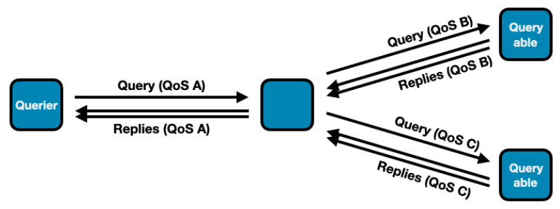

Sometimes it's the details that make the difference.

Named after the passionate serpent-dragon of Japanese legend, **Kiyohime** embodies this release's spirit: focused intensity on the things that matter. While 1.8.x doesn't reinvent the wheel, it sharpens every spoke - fixing the rough edges, closing the visibility gaps, and polishing the workflows you use every day.

Think about the last time you debugged a connectivity issue. You probably ssh'd into machines, grepped logs, and pieced together what was actually connected to what. Now imagine just calling an API that *tells* you - in real-time, with events when things change. That's the new **Connectivity API**, and it's available across every language binding.

Or consider QoS in query/reply patterns. The old approach let you configure different QoS per reply, which sounds flexible until it causes data loss because replies took different delivery paths. We simplified it: replies inherit their query's QoS. One less knob to turn, zero data loss bugs.

Zenoh-Pico gets two quiet performance wins that pack a punch: **4x faster key expression matching** (with linear-time algorithms that scale properly), and **Admin Space support** that brings the same introspection capabilities as the full stack. Constrained devices no longer mean flying blind.

Configuration gets friendlier too. **TOML support** means, for example, your ACL rules go from 37 lines of nested JSON to 18 lines of readable, maintainable config. And if you've battled reconnection issues in wireless networks, the **connectivity reestablishment fixes** eliminate those mysterious "it stopped working after the connection dropped" moments.

Here's what's in Kiyohime:

* **Connectivity API** — real-time visibility into transports, links, and topology changes across all bindings
* **TOML configuration** — cut config verbosity in half while staying fully compatible with JSON
* **Unified reply QoS** — prevent data loss by tying replies to their query's quality of service settings
* **Callback lifecycle control** — `wait_callbacks()` guarantees your callbacks finish before cleanup proceeds
* **Zenoh-Pico key expression performance** — linear-time matching with 4x improvements for common patterns
* **Zenoh-Pico Admin Space** — full session introspection for embedded systems and Zetta C2 integration
* **Liveliness token introspection** — new admin endpoint to query which tokens are alive right now
* **Reconnection reliability** — fixed traffic restoration after wireless network disruptions
* **Clearer Rust compatibility** — explicit Rust 1.75 support boundaries with better CMake tooling

A dozen thoughtful improvements that make Zenoh more observable, more reliable, and easier to work with.

Let's dive into the details.

## Connectivity API

For a long time, information about connected nodes and protocols was available only via the [Connectivity Status and Events](https://github.com/eclipse-zenoh/roadmap/blob/main/rfcs/ALL/Connectivity%20Status%20and%20Events.md) in the admin space. In this release, a first-class dedicated unstable API for connectivity data has been added.

The connectivity API is provided through [SessionInfo](https://docs.rs/zenoh/latest/zenoh/session/struct.SessionInfo.html) by methods `transports()` and `links()`. Each `Transport` represents the directly connected zenoh node. The `Transport` may contain one or more `Links`, and for each link the connectivity API provides access to the protocol, e.g, TCP/IP, QUIC, etc., the address, and port – or equivalent information, depending on the link's kind. 

The API also allows users to subscribe to changes through `transport_events_listener()` and `link_events_listener()`.

The `z_info` example has been extended to showcase the use of these APIs. Depending on your favorite programming language, look it up in the relevant repository: [Rust](https://github.com/eclipse-zenoh/zenoh/blob/main/examples/examples/z_info.rs), [C](https://github.com/eclipse-zenoh/zenoh-c/blob/main/examples/z_info.c), [C++](https://github.com/eclipse-zenoh/zenoh-cpp/blob/main/examples/universal/z_info.cxx), [Python](https://github.com/eclipse-zenoh/zenoh-python/blob/main/examples/z_info.py), [TypeScript](https://github.com/eclipse-zenoh/zenoh-ts/blob/main/zenoh-ts/examples/deno/src/z_info.ts), [Zenoh-Pico](https://github.com/eclipse-zenoh/zenoh-pico/blob/main/examples/unix/c11/z_info.c).

For example, in Rust:

```
> cargo run --example z_info --features unstable
Opening session...
zid: 2095d1a29bb73c25e78f9d1898d692bd
routers zid: [bebae9e35f683ffa507545899e87d221]
peers zid: []

transports:
Transport { zid: bebae9e35f683ffa507545899e87d221, whatami: Router, is_qos: true, is_multicast: false }

links:
Link { zid: bebae9e35f683ffa507545899e87d221, src: tcp/192.168.21.80:52475, dst: tcp/192.168.21.80:7447, group: None, mtu: 65328, is_streamed: true, interfaces: ["en0"], auth_identifier: None, priorities: Some((0, 7)), reliability: Some(Reliable) }
```

Below are the examples of connectivity API usage in the code:

Get list of links per each transport on Rust:

```
let session = zenoh::open(zenoh::Config::default()).await.unwrap();
let transports = session.info().transports().await;
if let Some(transport) = transports.into_iter().next() {
    let links = session.info().links().transport(transport).await;
    for link in links {
        println!("Link: {} -> {}", link.src(), link.dst());
    }
}
```

Listen to transport updates in C:

```
void transport_event_handler(z_loaned_transport_event_t* event, void* ctx) {
    z_sample_kind_t kind = z_transport_event_kind(event);
     if (kind == Z_SAMPLE_KIND_PUT) {
        printf("[Transport Event] Opened:\n");
    } else {
        printf("[Transport Event] Closed:\n");
    }
}
...
z_owned_closure_transport_event_t transport_event_callback;
z_closure(&transport_event_callback, transport_event_handler, NULL, NULL);
z_transport_events_listener_options_t transport_opts;
z_transport_events_listener_options_default(&transport_opts);
transport_opts.history = true; // Show also already existing transports
z_result_t res = z_declare_background_transport_events_listener(z_loan(s), z_move(transport_event_callback), &transport_opts);
```

## TOML Configuration 

Zenoh configuration files may now be written in TOML in addition to JSON (and JSON5). This feature is gated behind the `unstable` feature flag of the `zenoh` crate.

TOML's [Array of Tables](https://toml.io/en/v1.1.0#array-of-tables) syntax allows for more concise syntax for configuration that relies on object lists, such as ACL, where a simple one-rule, one-subject and one-policy specification easily spans 37 lines and 4 levels of indentation:

```
{
 "access_control": {
   "enabled": false,
   "default_permission": "deny",
   "rules": [
     {
       "id": "rule1",
       "messages": [
         "put"
       ],
       "flows": [
         "ingress"
       ],
       "permission": "allow",
       "key_exprs": [
         "example"
       ]
     }
   ],
   "subjects": [
     {
       "id": "subject1",
       "cert_common_names": [
         "example.zenoh.io"
       ]
     }
   ],
   "policies": [
     {
       "id": "policy1",
       "rules": [
         "rule1"
       ],
       "subjects": [
         "subject1"
       ]
     }
   ]
 }
}
```

The equivalent TOML syntax for the above ACL specification is the following:

```
[access_control]
enabled = true
default_permission = "deny"

[[access_control.rules]]
id = "rule1"
messages = ["put"]
permission = "allow"
key_exprs = ["example"]

[[access_control.subjects]]
id = "subject1"
cert_common_names = ["example.zenoh.io"]

[[access_control.policies]]
id = "policy1"
rules = ["rule1"]
subjects = ["subject1"]
```

Down to 18 lines! Visual clutter is also greatly diminished: each individual rule, subject, and policy is cleanly separated from the rest of the config with preceding and succeeding whitespace — making them easier to read and modify.

TOML also enjoys better support within the Rust ecosystem — by virtue of its use in Cargo — compared to [YAML](https://noyaml.com/) for example. This makes it a safe and maintainable choice for the future and a good candidate for overcoming the existing issues with JSON5. We encourage users to write new system configuration in TOML; feedback would be fruitful in deciding the next steps for Zenoh's configuration approach.

## Query Reply QoS Changes

The possibility to change the QoS of individual query replies was causing problems in reply handling that could result in potential data loss — for instance, by setting the congestion control to drop. To prevent this, replies must be sent with the same QoS. In version 1.8.0, replies will use the QoS of their related query. Methods and functions that allowed setting the Priority and CongestionControl of individual replies have been deprecated ([congestion_control](https://docs.rs/zenoh/latest/zenoh/query/struct.ReplyBuilder.html#method.congestion_control), [priority](https://docs.rs/zenoh/latest/zenoh/query/struct.ReplyBuilder.html#method.priority)). They will have no effect until they are completely removed. The QoS overwrite configuration entries that allowed overwriting reply QoS have been [removed](https://github.com/eclipse-zenoh/zenoh/blob/c3761375d202931107388336fdebedbc1bfb56e5/DEFAULT_CONFIG.json5#L304).

**Note:** This change does not prevent applying different QoS to the same query in different branches of the query routing tree. The QoS overwrite configuration entries that allow overwriting query QoS have been preserved.

Example:



## Query / Reply Key Invariants

By default, Zenoh imposes the invariant that replies to a query must use key expressions that match that of the query — otherwise, the reply will fail with an error at the API level. This constraint, while maintaining an important invariant, prevents some important use cases. A query option allows bypassing this constraint, but the function to set this option (`accept_replies`) was unstable. This release stabilizes this function.

## Callback Drop Changes

Since the Zenoh runtime runs user-provided callbacks in a separate thread, when a Zenoh entity like Subscriber or Queryable gets undeclared or dropped, it is possible that the callback provided by the user upon this entity's creation might still be running and would be dropped some time after the undeclare or drop operation returns. In some situations this might be inconvenient, so we introduced an option to all undeclare builders to block until all related callbacks stop running and are dropped. This API is currently only available in Rust and can be used as follows:

```
let session1 = zenoh::open(config1).await.unwrap();
let session2 = zenoh::open(config2).await.unwrap();
// ...
let queryable = session.declare_queryable(ke).callback(queryable_cb).await.unwrap();
// ...
let replies = session2.get(ke).callbacks(reply_cb).await().unwrap();
// ...
queryable.undeclare().wait_callbacks().await.unwrap(); // after this line queryable_cb is guaranteed to be dropped
// ...
session2.close().wait_callbacks().await.unwrap(); // after this line reply_cb is guaranteed to be dropped
```

In Zenoh-C and Zenoh-C++, all drop and undeclare operations now unconditionally wait until callbacks finish and are destroyed (i.e., the provided user drop function returns).

## Connectivity reestablishment fixes

In some situations, after a loss of connectivity (typically in mobile networks like 4G and 5G), problems were occurring at connectivity reestablishment that were causing Zenoh traffic not to be restored properly. Those bugs have been fixed, and Zenoh traffic is now properly restored once the underlying connectivity is recovered.

## Rust version update

Release of Rust 1.93 posed a new challenge to our efforts to maintain compatibility with Rust 1.75. Some older versions of crates we depend on no longer work with Rust 1.93, so we had to adapt our existing [approach](https://zenoh.io/blog/2025-10-20-zenoh-imoogi/#rust-175-compatibility-improvement). Therefore, starting with this release, support for Rust 1.75 is guaranteed only for zenoh and zenoh-c. All other projects have been switched to the latest Rust version, and their dependency on zenoh-pinned-deps-1-75 has been removed.

The most important change is that zenoh-c now properly [supports](https://github.com/eclipse-zenoh/zenoh-c?tab=readme-ov-file#rust-version) selecting the Rust version through a CMake variable. This functionality existed before but had never been properly tested. When Rust 1.75 is selected, the dependency on zenoh-pinned-deps-1-75 is automatically injected and the compilation succeeds. For other older Rust versions, the build is not guaranteed and manual tweaks may be necessary.

## Admin Space Updates

A new admin space endpoint was added: `@/{zid}/{client|peer|router}/token/**`. It allows users to see current liveliness tokens declared on the node.

Try this:

```bash
> cargo run --example z_liveliness -- --cfg="adminspace/enabled: true"
Opening session...
Declaring LivelinessToken on 'group1/zenoh-rs'...
Press CTRL-C to undeclare LivelinessToken and quit...
----
> cargo run --example z_get -- -s "@/*/*/token/**"
Opening session...
Sending Query '@/*/*/token/**'...
>> Received ('@/4c4bc380e7558418801f04161eba74ea/peer/token/group1/zenoh-rs': '{"routers":[],"peers":["4c4bc380e7558418801f04161eba74ea"],"clients":[]}')
```

## Zenoh-Pico

### Admin Space and Zetta C2 Support

This release introduces Admin Space support in Zenoh-Pico, enabling lightweight introspection of running sessions and providing the foundation required for integration with tooling.

Zenoh’s Admin Space exposes internal runtime information through the Zenoh query mechanism, allowing tools and services to retrieve runtime state in a uniform and protocol-native way. Bringing this capability to Zenoh-Pico makes it possible to monitor and inspect constrained devices using the same mechanisms available in the full Zenoh stack.

The initial implementation adds a Pico-specific admin space exposing session information, including transport and peer details. Queries against this space allow external tools to discover runtime state without requiring device-specific management interfaces.

#### Enabling the Admin Space

The Admin Space in Zenoh-Pico is currently considered an unstable feature and is therefore disabled by default. Enabling it requires activating both the unstable API and the admin space feature at build time.

This can be done by enabling the following CMake options when building Zenoh-Pico:

```
 -DZ_FEATURE_UNSTABLE_API=1
 -DZ_FEATURE_ADMIN_SPACE=1
```

After building with these features enabled, the Admin Space must also be explicitly started at runtime. This is done by calling:

zp_start_admin_space()

#### Queryable Endpoints

Once the Admin Space has been started, Zenoh-Pico exposes a small set of queryable endpoints under the Pico admin namespace. These endpoints provide both a convenient high-level summary and a way to drill down into more specific transport and peer information.

The currently exposed endpoints are:

* `@/<zid>/pico`
* `@/<zid>/pico/session`
* `@/<zid>/pico/session/transports`
* `@/<zid>/pico/session/transports/0`
* `@/<zid>/pico/session/transports/0/peers`
* `@/<zid>/pico/session/transports/0/peers/<peer_zid>`

This structure is intentionally hierarchical. Higher-level endpoints provide a broader view of the current session state, while lower-level endpoints allow more targeted inspection of a specific transport or connected peer.

The top-level pico endpoint is intended as the main entry point. Querying it returns a rolled-up view of the current Zenoh-Pico session, making it easier for users and external tools to obtain useful runtime information from a single query. Rather than having to first discover each transport and then query peers individually, a query on pico provides a concise summary of the node’s current state.

The more specific endpoints can then be used to explore the structure in greater detail. For example:

* `@/<zid>/pico/session` — provides session-level information
* `@/<zid>/pico/session/transports` — exposes the list of session transports
* `@/<zid>/pico/session/transports/0` — provides details for the first transport
* `@/<zid>/pico/session/transports/0/peers` — lists the peers connected through that transport
* `@/<zid>/pico/session/transports/0/peers/<peer_zid>` — provides information for a specific peer

For example, querying:

```
@/<zid>/pico
```

Will return a response similar to:

```json
{
   "session": {
    "zid": "4d635579e06bb9a731c0fbd2ce405489",
    "whatami": "client",
    "transports": [
      {
        "type": "unicast",
        "link": {
          "type": "tcp",
          "endpoint": {
            "locator": {
              "metadata": {},
              "protocol": "tcp",
              "address": "10.30.0.227:7447"
            },
            "config": {}
          },
          "capabilities": {
            "transport": "unicast",
            "flow": "stream",
            "is_reliable": true
          }
        },
        "peers": [
          {
            "zid": "745603c94e55f1feafae5c8bd523d4af",
            "whatami": "router"
          }
        ]
      }
    ]
  }
}
```

#### Example Applications

Several of the Zenoh-Pico example applications enable the Admin Space when the feature is available. This provides a convenient way to experiment with the functionality without needing to modify application code.

For example, the `z_pub` example will start the Admin Space if it has been compiled with the required features `Z_FEATURE_UNSTABLE_API` and `Z_FEATURE_ADMIN_SPACE` enabled.

#### References and Examples

For more details and example usage, see the following resources:

**Zenoh-Pico Examples**

* `z_pub` example (demonstrates starting the admin space when enabled): \
[https://github.com/eclipse-zenoh/zenoh-pico/blob/main/examples/unix/c11/z_pub.c](https://github.com/eclipse-zenoh/zenoh-pico/blob/main/examples/unix/c11/z_pub.c)

**Pull Requests**

* Add Admin Space support: \
[https://github.com/eclipse-zenoh/zenoh-pico/pull/1125](https://github.com/eclipse-zenoh/zenoh-pico/pull/1125)
* Roll up session information in the Admin Space: \
[https://github.com/eclipse-zenoh/zenoh-pico/pull/1173](https://github.com/eclipse-zenoh/zenoh-pico/pull/1173)

**Zenoh Documentation**

* Zenoh key expressions: \
[https://zenoh.io/docs/manual/abstractions/#key-expressions](https://zenoh.io/docs/manual/abstractions/#key-expressions)
* Zenoh-Pico Admin Space documentation: \
[https://zenoh-pico.readthedocs.io/en/latest/api.html#admin-space](https://zenoh-pico.readthedocs.io/en/latest/api.html#admin-space)

### Key Expression Matching Optimization

We significantly improved the performance of computing key expression intersection and inclusion in Zenoh-Pico. For the majority of common use cases (i.e., no more than one `**` per key expression and no more than one `$*` per key expression chunk), the complexity of key expression matching is now linear with respect to the key expression lengths. Additionally, the number of times we needed to run through each key expression string was also reduced, which improves matching even for simpler key expressions by approximately a factor of 4. 

More details regarding performance improvement for different key expression forms can be found in the corresponding PR description: https://github.com/eclipse-zenoh/zenoh-pico/pull/1175#issuecomment-4017437002. 

This improvement essentially implies that the amount of time the controller would spend on determining to which subscribers/queryables the newly received message should be delivered is no longer dominated by the key expression complexity.

## Changelogs

The full changelog for every Zenoh repository is available at the following links:

[Rust](https://github.com/eclipse-zenoh/zenoh/releases) | [C](https://github.com/eclipse-zenoh/zenoh-c/releases) | [C++](https://github.com/eclipse-zenoh/zenoh-cpp/releases) | [Python](https://github.com/eclipse-zenoh/zenoh-python/releases) | [Java](https://github.com/eclipse-zenoh/zenoh-java/releases) | [Kotlin](https://github.com/eclipse-zenoh/zenoh-kotlin/releases) | [TypeScript](https://github.com/eclipse-zenoh/zenoh-ts/releases) | [Pico](https://github.com/eclipse-zenoh/zenoh-pico/releases) | [DDS plugin](https://github.com/eclipse-zenoh/zenoh-plugin-dds/releases) | [ROS2 plugin](https://github.com/eclipse-zenoh/zenoh-plugin-ros2dds/releases) | [MQTT plugin](https://github.com/eclipse-zenoh/zenoh-plugin-mqtt/releases) | [WebServer plugin](https://github.com/eclipse-zenoh/zenoh-plugin-webserver/releases) | [Filesystem backend](https://github.com/eclipse-zenoh/zenoh-backend-filesystem/releases) | [RocksDB backend](https://github.com/eclipse-zenoh/zenoh-backend-rocksdb/releases) | [S3 backend](https://github.com/eclipse-zenoh/zenoh-backend-s3/releases) | [InfluxDB backend](https://github.com/eclipse-zenoh/zenoh-backend-influxdb/releases)

And that's Kiyohime.

These are the updates that don't make headlines but save hours of debugging at 2am when production goes sideways.

If you're building distributed systems - whether that's orchestrating cloud services, coordinating edge devices, or wrangling IoT fleets - Kiyohime has something for you. Better visibility. Fewer surprises. Cleaner configs. Faster matching.

We built this release by listening. Your bug reports on reconnection issues. Your feature requests for better introspection. Your pain points with nested JSON configs. Keep that feedback coming - it's how Zenoh gets better.

Try it out. Break it. Tell us what works and what doesn't. We're on [Discord](https://discord.com/invite/vSDSpqnbkm) and always happy to talk.

**– The Zenoh Team**

